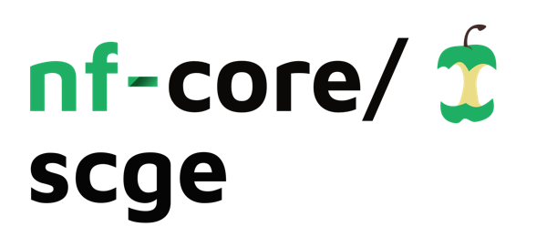
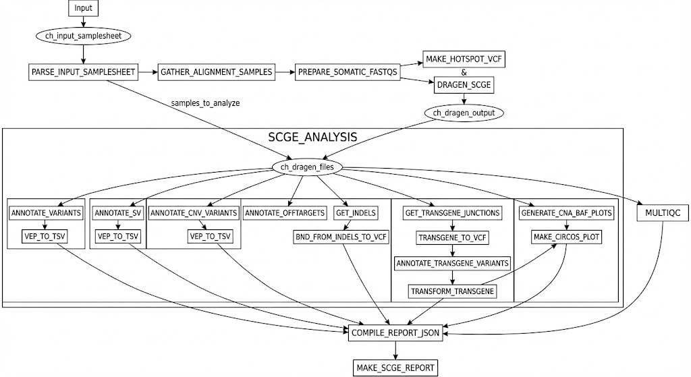

<h1>
  <picture>
    <source media="(prefers-color-scheme: dark)" srcset="docs/images/nf-core-scge_logo_dark.png">
    
  </picture>
</h1>

[](https://www.nextflow.io/)
[](https://www.docker.com/)
[](https://sylabs.io/docs/)

## Introduction

**dhslab/nf-core-scge** is a Nextflow DSL2 pipeline for **somatic cell genome editing (SCGE)**
analysis. It takes tumor (edited) / normal (unedited) sequencing through DRAGEN alignment
(optional) and characterises the consequences of CRISPR editing: on/off-target edits,
transgene integration, and genome-wide structural and copy-number changes, then compiles a
per-sample HTML report. It is built for the WashU RIS clusters (Compute1/LSF, Compute2/SLURM)
and AWS Batch.

The pipeline has **two entry points**:

1. **`SCGE`** (default) — the full per-sample analysis and report.
2. **`OFFTARGET`** (`-entry OFFTARGET`) — the **Unified CRISPR Off-Target Workflow**: a WGS hotspot
   edit-confirmation model (trained on error-corrected ECS truth) plus a genome-wide, PoN-filtered
   worklist for review. Validated end-to-end on a real AAVS1 run: the on-target is recovered from WGS
   alone, as is the one confirmed off-target we have (PLCB2 chr12:32,679,410, 90% VAF). Real
   off-targets are rare and high-VAF in both cohorts (editing is highly on-target-specific), so a
   sub-5% off-target floor is unproven — trust WGS-only calls at hotspots **≥5% VAF**. Scope and
   validation in [`docs/OFFTARGET_WORKFLOW.md`](docs/OFFTARGET_WORKFLOW.md).

## Pipeline summary

**Default `SCGE` workflow** (`workflows/scge.nf`):

1. **DRAGEN** tumor/normal alignment + small-variant / SV / CNV calling *(optional; `--run_alignment false` to skip)*
2. **VEP** annotation of SNVs/indels, SVs, and CNVs → TSV
3. **Off-target editing** detection at nominated sites (`GET_INDELS`)
4. **Transgene** integration-junction identification and annotation
5. **CNA / BAF** plots and a **Circos** genome overview
6. **Report**: results compiled to JSON (`COMPILE_REPORT_JSON`) and rendered to HTML (Quarto)
7. **MultiQC** aggregate QC



**`OFFTARGET` workflow** (`workflows/offtarget.nf`): `ECS_INDELS` (error-corrected truth VAF at
hotspots) + `WGS_WORKLIST` → `PON_OFFTARGET_FILTER` (genome-wide, homology-free, Panel-of-Normals
filtered worklist) → per-hotspot WGS scoring → `training.tsv` (WGS features × ECS VAF) → a
recall-vs-VAF curve and a reconciled report. Full details in
[`docs/OFFTARGET_WORKFLOW.md`](docs/OFFTARGET_WORKFLOW.md).

<picture>
  <source media="(prefers-color-scheme: dark)" srcset="docs/images/offtarget_metro_dark.svg">
  
</picture>

## Usage

### Default SCGE pipeline

**Alignment + analysis** — samplesheet with one tumor and one normal row per case (shared `uid`):

```csv
id,uid,sample_type,fastq_list,hotspot_file
tumor_sample_1,case1,tumor,/path/to/fastq_list.csv,/path/to/hotspot.csv
normal_sample_1,case1,normal,/path/to/fastq_list.csv,/path/to/hotspot.csv
```

**Analysis only** (`--run_alignment false`) — **the low-barrier on-ramp: no DRAGEN license or
FPGA hardware required.** If you already have DRAGEN output directories (from a prior run, a core,
or a collaborator), point at them and the pipeline runs only the annotation/report half. Use a
plain container profile (`docker`/`singularity`/`apptainer`) — the `dragen4`/`dragenaws` profiles
are needed **only** when actually aligning.

```csv
id,dragen_path,target_file
sample1,/path/to/dragen_output/sample1,/path/to/sample1.targets.vcf
```

```bash
# analysis only — no DRAGEN needed:
nextflow run . -profile ris2,apptainer \
    --input mastersheet.csv --run_alignment false \
    --outdir ./results
```

**Alignment + analysis** — requires a DRAGEN license + reference; add the DRAGEN profile:

```bash
nextflow run . -profile ris,dragen4 \
    --input mastersheet.csv \
    --outdir ./results
```

Compute profiles: `-profile ris` (Compute1/LSF) or `ris2` (Compute2/SLURM), plus a container
engine (`apptainer`/`singularity`/`docker`); add `dragen4` (local DRAGEN) or `dragenaws` (AWS
DRAGEN) **only when aligning**. `-profile stub` gives a dependency-free dry run.

### Unified CRISPR Off-Target Workflow

```bash
# RIS Compute2 (SLURM + Apptainer) — the validated path. One wrapper for any cohort:
sbatch run_offtarget.sh --input <samplesheet.csv> --outdir <dir> [--snapshots]

# or directly (from a node that can sbatch, not the interactive exec node):
nextflow run . -entry OFFTARGET -profile ris2,apptainer \
    --input offtarget_samplesheet.csv \
    --outdir ./results_offtarget -resume
```

On RIS Compute1 (LSF) run `nextflow run . -entry OFFTARGET -profile ris` under `bsub`. Samplesheet
`sample,datatype{ecs|wgs},guide,edited_cram,control_cram,target_file,vcf` — template at
`assets/offtarget_samplesheet_template.csv`. When `-entry OFFTARGET` is given, the default SCGE
workflow does not run. Full docs: [`docs/OFFTARGET_WORKFLOW.md`](docs/OFFTARGET_WORKFLOW.md).

Add `--offtarget_snapshots true` to render an IGV-style **edited-vs-normal** read pileup for every
LIKELY EDIT (into `<outdir>/offtarget/snapshots/`) — by-eye verification straight from the CRAM:


## Key parameters

| Parameter | Default | Description |
|---|---|---|
| `--input` | — | samplesheet / mastersheet CSV (required) |
| `--outdir` | — | output directory (required) |
| `--run_alignment` / `--run_analysis` | `true` / `true` | toggle the DRAGEN and analysis halves |
| `--fasta` | hg38 + transgene FASTA on storage2 | reference (with the CAR/transgene contig) |
| `--transgene_name` | `PLVM_CD19_CARv4_cd34` | transgene contig name in the reference |
| `--crispr_model` | `assets/models/site14_site5_combined_model.pkl` | model for `GET_INDELS` edit classification |
| `--off_target_threshold` | `1.0` | ML score threshold for off-target calls |
| `--vepcache` | VEP113 cache on storage2 | VEP annotation cache |
| `--offtarget_shape_model` | `assets/models/wgs_shape_model.pkl` | pileup shape ranker (OFFTARGET arm) |
| `--offtarget_min_af` / `--offtarget_min_span` | `0.05` / `8` | WGS candidate AF floor / coverage gate |
| `--offtarget_hi_score` / `--offtarget_target_recall` | `0.60` / `0.80` | recall-curve detection threshold / target |

## Containers

| Purpose | Image |
|---|---|
| Analysis + off-target | `ghcr.io/dhslab/docker-scge:latest` |
| Report rendering | `ghcr.io/dhslab/docker-quarto-chromoseq:latest` |
| Off-target annotation (VEP) | `ghcr.io/dhslab/docker-vep_release113` |
| CRISPR_ML | `TBD` |

Nextflow itself runs inside `ghcr.io/dhslab/docker-baseimage:latest` on RIS (see `run.sh`).

## Testing

- **Python glue-script tests** (no CRAM/model needed): `pytest tests/` — run with an interpreter
  that has `pandas` (e.g. inside `docker-scge`). Covers the OFFTARGET ECS⋈WGS join, the
  recall-vs-VAF logic, and the coordinate-mismatch guardrail.
- **Nextflow dry run**: `nextflow run . -profile stub --input <samplesheet> --outdir ./stub` (or add
  `-entry OFFTARGET`). Requires Java 17+ (present in the RIS container).

## Credits

dhslab/nf-core-scge was originally written by Nidhi and is developed and maintained by the
[Spencer Lab](https://www.davidspencerlab.org/) (Washington University in St. Louis). Built with the
[nf-core](https://nf-co.re) framework.

## Citations

Tool and data references are listed in [`CITATIONS.md`](CITATIONS.md). If you use the nf-core
framework, please cite:

> **The nf-core framework for community-curated bioinformatics pipelines.**
> Philip Ewels, Alexander Peltzer, Sven Fillinger, Harshil Patel, Johannes Alneberg, Andreas Wilm,
> Maxime Ulysse Garcia, Paolo Di Tommaso & Sven Nahnsen.
> _Nat Biotechnol._ 2020. doi: [10.1038/s41587-020-0439-x](https://dx.doi.org/10.1038/s41587-020-0439-x).
