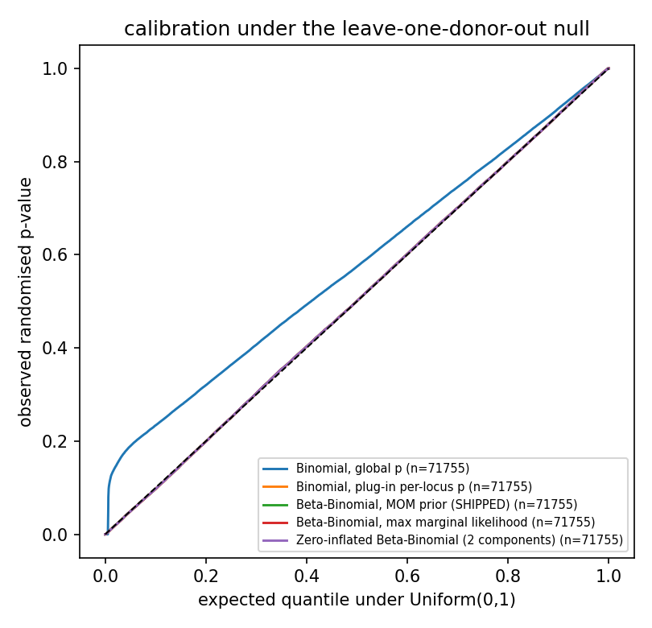
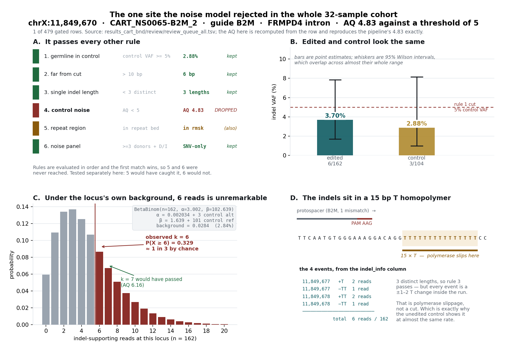
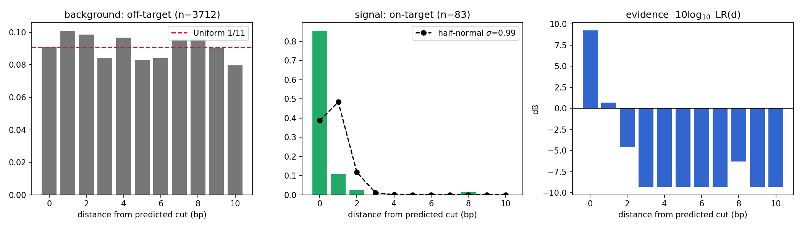

# The background model, and exactly how AQ is computed

This is a methods document. It states where the background rate comes from, what AQ is as a
statistical object, and what the model does and does not claim. It is deliberately explicit about
the name of the distribution at every step, because the model has been described verbally more
than once and the verbal version keeps losing the part that matters.

Companion documents:

- [`NOISE_MODEL_VALIDATION.md`](NOISE_MODEL_VALIDATION.md) — does the model actually describe the
  data? (calibration, model comparison, sequence context, the depth floor)
- [`PANEL_AS_FILTER.md`](PANEL_AS_FILTER.md) — can the DRAGEN systematic-noise panels replace the
  matched control?

Implementation: [`bin/noise_model.py`](../bin/noise_model.py). All numbers below are from the
32-sample CAR-T cohort in `results_cart_bnd` (2026-08-17).

---

## 1. The sampling process is Binomial

At a locus covered by `n` reads, each read either carries the alt allele or does not. Treat the
reads as independent, each with probability `p` of carrying it — a Bernoulli trial per read — and
the count of alt reads is

```
k ~ Binomial(n, p)
```

This is the machine drawing reads. It is the uncontroversial half of the model, and nothing below
disputes it.

## 2. `p` is not one number, which is why the compound is Beta-Binomial

The error rate is not a constant of the assay. It varies from locus to locus with what the
polymerase and the aligner are physically doing at that sequence — slippage in a homopolymer run
is the textbook case, and [it is measured on this cohort](NOISE_MODEL_VALIDATION.md#4-sequence-context):
sites inside a ≥9 bp homopolymer carry control indel evidence at **33× the rate seen in unique
sequence** (0.0392 vs 0.0012).

So `p` is itself a random variable. Model the spread of rates with a continuous distribution on
(0,1) — the Beta — and compound:

```
p ~ Beta(α, β)
k ~ Binomial(n, p)      ⟹      k ~ BetaBinomial(n, α, β)
```

**The Beta is the mixing distribution over rates. It is not a model of the read counts.** It is
what carries the overdispersion that a fixed-`p` Binomial cannot represent, and the overdispersion
is the entire point: the output of this model is a tail probability, and a tail is exactly where
the difference between "one rate" and "a distribution of rates" shows up.

### Why a Binomial alone fails, in one line

It assumes every locus and every sample share one rate. At a locus where 1 of 46 panel donors
showed 17% noise and 45 showed nothing, a Binomial uses `p = 0.0037` and declares a 5% observation
overwhelming.

That is not a hypothetical. Under a null where every observation is noise by construction (see
[the validation doc](NOISE_MODEL_VALIDATION.md#3-calibration)), the Binomial produces **5.2× more
p-values below 0.001 than it should**, and fails a Kolmogorov–Smirnov test against Uniform with
D = 0.140. The Beta-Binomial sits at D ≈ 0.004 on the same test — a 35× smaller deviation, stable
across random seeds. (The test uses randomised p-values, so its *p*-value is seed-dependent and
only D should be quoted; the validation doc reports the full seed sweep.)



## 3. Where α and β come from

Two steps, and both are in `noise_model.py`.

**Step 1 — the global prior, fitted once per run.** `fit_global_prior()` takes every control
observation in the input (`control_indel_reads` out of `control_reads`, one pair per site-row) and
fits a Beta by **method of moments**: match the mean and variance of the observed per-observation
control VAFs. On this cohort:

```
Beta(a0 = 0.002034, b0 = 1.63924)      prior mean = 0.00124
```

Note `a0 < 1 < b0`. That makes the density **strictly decreasing** — infinite at `p = 0`, zero at
`p = 1`. The prior is spike-at-zero shaped with a heavy right tail. This matters and comes back in
[§2.1 of the validation doc](NOISE_MODEL_VALIDATION.md#1-the-two-populations).

**Step 2 — the per-locus update, which is conjugate.** The Beta is conjugate to the Binomial, so
observing `control_alt` alt reads out of `control_depth` at a locus updates the prior in closed
form (`control_posterior()`, `noise_model.py:191-217`):

```
α = a0 + control_alt
β = b0 + (control_depth − control_alt)
```

Which controls are pooled is the `--baseline` switch: `matched` (this sample's own control — what
ships), `loo` (the other samples' controls), `both`, or `panel` (external panel, no controls).

**Step 3 — the depth floor** (`apply_depth_floor()`). A control with zero alt reads at depth `d`
does not show the background is ~0; it shows it is below roughly `1/d`. The floor bounds the
posterior *mean* at `1/control_depth`, holding `α + β` fixed so only the location moves. It raises
the background on **306 of 479** gated rows in this run. Whether it is a principled step or a patch
on a mis-specified model is exactly [what the validation doc tests](NOISE_MODEL_VALIDATION.md#5-the-depth-floor).

## 4. AQ, stated exactly

```
AQ = −10 · log₁₀ P(X ≥ k | n, α, β),     X ~ BetaBinomial(n, α, β)
```

**AQ is the Phred-scaled tail probability under the null hypothesis that the observation is
background.** It is a survival function — a p-value expressed in decibels — and it measures
evidence *against* H₀, on the same log scale as every other quality score in genomics.

> ⚠️ **AQ is not a likelihood ratio.** It is a p-value. The two are different objects and the
> distinction is not pedantic: a p-value asks "how extreme is this under H₀?" and never mentions
> the alternative, whereas a likelihood ratio compares two named hypotheses. A genuine likelihood
> ratio does appear in this work — in [§6](#6-distance-from-the-cut-as-a-spatial-prior), where the
> spatial model forms `P(d | signal) / P(d | background)`. Keep the two apart when describing this.

### AQ to probability — the table to have in the room

| AQ | P(X ≥ k \| H₀) | reading |
|---:|---:|---|
| 0 | 1.0 | certain under background |
| **5** | **0.316** | **the shipped cut** — ~1 in 3 by chance |
| 10 | 0.1 | 1 in 10 |
| 20 | 0.01 | 1 in 100 |
| 30 | 0.001 | 1 in 1,000 |
| 60 | 10⁻⁶ | 1 in a million |

**The shipped threshold of AQ < 5 is extremely permissive.** It is not a p < 0.05 test — it drops
only observations that background explains *at least a third of the time*. That is why it removes
exactly **1 of the 479 gated rows** in this cohort. Anyone reading "the noise model filters the
calls" should know it is currently the weakest rule in the stack, by design: it was placed to catch
the unambiguous cases and leave the judgement calls to the reviewer.

## 5. A worked example, end to end

The single row the model rejected in the whole cohort: **chrX:11,849,670 in CART_NS0065-B2M_2**,
an intron of *FRMPD4*, guide B2M.

```
observed          k = 6 indel reads out of n = 162          (VAF 3.70%)
matched control   3 indel reads out of 104                  (VAF 2.88%)

α = a0 + control_alt = 0.002034 +   3 =   3.002034
β = b0 + control_ref = 1.639    + 101 = 102.639235
background = α/(α+β) = 0.028417                             (2.84%)

P(X ≥ 6 | n = 162, α, β) = 0.328686
AQ = −10 log₁₀(0.328686) = 4.83                             → below 5 → dropped
```

This reproduces the pipeline's output exactly, and can be re-derived from the row in
`results_cart_bnd/review/review_queue_all.tsv`.



**It is also the cleanest illustration of the physics.** The four events at this site are ±1–2 T's
inside a **15 bp T homopolymer** — polymerase slippage, not a cut. That is why the unedited matched
control shows it at nearly the same rate (2.88% vs 3.70%), and why the model is right to reject it.
Had `k` been 7 instead of 6, AQ would be 6.16 and the row would have been kept: the threshold is
close, and the honest description is "this site is a coin-flip", not "this site is noise".

## 6. Distance from the cut as a spatial prior

The fourth ask was to model the distance-from-PAM distribution empirically rather than assert a
threshold. `bin/cut_distance_model.py` does that; this is the result.

`review_filter.py` currently treats distance as a boolean: keep if `cut_dist_min ≤ 10`. That 10 is
inherited from the caller's own `-d/--max-mutation-distance` default and was never derived from
data. Modelled properly there are two components, one per process:

| | n | median | shape |
|---|---:|---:|---|
| background (off-target rows with indel evidence) | 3,712 | 5 | **Uniform** — every bin within 1.1 points of 9.09% |
| signal (on-target rows, real Cas9 cuts) | 83 | 0 | **spike at the cut** — 96.4% at d ≤ 1 |

**Background is Uniform because an artifact has no reason to prefer any offset** relative to a
predicted cut site. That is a prediction, and it holds: bins run 7.97%–10.10% against a uniform
expectation of 9.09%. (A chi-square over 3,712 observations does reject *exact* uniformity at
p = 0.02 — at that n a fraction-of-a-point wobble is detectable. Uniform is an excellent working
null, not an exact property, and it is quoted that way.)

**Signal is a sharp spike at 0–1 bp**, set by Cas9 blunt-end geometry and broadened only by repair
microhomology and by where the aligner chose to place the indel.

Given both, the evidence carried by an observed distance is a **genuine likelihood ratio**:

```
LR(d) = P(d | signal) / P(d | background)
```



| d (bp) | P(d \| signal) | P(d \| bg) | LR | evidence (dB) |
|---:|---:|---:|---:|---:|
| 0 | 0.766 | 0.0909 | 8.43 | **+9.3** |
| 1 | 0.106 | 0.0909 | 1.17 | +0.7 |
| 2 | 0.032 | 0.0909 | 0.35 | −4.6 |
| 3–10 | ~0.011 | 0.0909 | 0.12 | −9.3 |

> **The signal column is add-one (Laplace) smoothed**, so it will not match a raw histogram of the
> 83 on-target events — raw, d = 0 is 71/83 = 0.855, and bins 3–10 are empty. Smoothing spreads one
> pseudo-count over all 11 bins: (71+1)/(83+11) = 0.766 at d = 0, and 1/94 = 0.011 in the empty
> bins. Without it the LR is infinite wherever no on-target event happened to land, which is an
> artifact of n = 83 rather than a statement about Cas9. The background column is unsmoothed —
> at n = 3,712 no bin is empty. See [`cut_distance_model.py:75`](../bin/cut_distance_model.py).

The last column is on the same decibel scale as AQ, which is the point: a distance of 0 contributes
+9.3 dB of evidence and a distance of 10 contributes −9.3 dB, instead of both being "inside the
window, therefore fine". That makes distance combinable with AQ in log space rather than a separate
boolean hurdle.

### What it is worth in practice — reported honestly

On the 135 labelled gated rows, distance alone is a much better filter than the shipped threshold:

| threshold | confirmed kept | rejected kept |
|---|---|---|
| d ≤ 2 | **64/64** | 41/71 |
| d ≤ 10 (shipped) | 64/64 | 71/71 |

The full-recall plateau extends all the way down to **d ≤ 2**, not just to 6 as previously
believed — at which point it removes 30 of the 71 human-rejected rows for free.

**But it changes almost nothing operationally.** After rules 1–3 have run, tightening the threshold
to 2 moves the final queue from 86 rows to 85 and removes **zero** labelled negatives: all 8
rejected rows that survive to the queue already sit at d ≤ 1. The spatial rule is largely
*redundant* with the germline and length-diversity rules on this cohort.

So the recommendation is not "tighten the threshold". It is that the LR is worth having **as a
score**, for ranking the queue and for the single-sample case where no matched control exists and
rule 1 is unavailable. That is where a rule that needs no cohort and no control earns its place.

### One limitation, stated rather than worked around

The caller's `-d` default is 10 and `get_indels.nf` passes no override, so `min_cut_distance` is
only ever observed on events the caller already accepted at ≤ 10 bp. **The shape above is measured
inside the window we are allowed to see; the tail beyond 10 bp is not estimable from these tables.**

`indel_info` field 7 is uncapped (4,811 events, reaching 28 bp, 7.8% beyond 10) and shows the tail
is real and thin — but it is the *anchor-only* distance, a different and always-larger quantity
than `min_cut_distance`. It is usable for tail shape with that caveat attached, and must not be
pooled with the numbers above. Only a re-run with a larger `-d` would settle it.

---

## What this model does NOT claim

1. **It does not claim the control measures the machine-error rate.** At the median control depth
   of 157×, one read is 0.64% VAF, so the control cannot *resolve* any rate below ~0.6%. 99.4% of
   control observations are exactly zero. That zero is a detection limit, not a measurement.

2. **It does not claim a single Beta separates error from germline.** It demonstrably does not:
   the control-rate distribution is a point mass at 0 plus a germline mode near 0.18, with nothing
   between (zero observations in the interval (0, 0.001)). What the validation doc shows is that
   the *fitted shape* still produces calibrated tail probabilities — which is a weaker and more
   honest claim than "the model separates the two processes".

3. **It does not claim AQ is a probability that a call is real.** It is P(data | background). Going
   from there to P(real | data) needs a prior on how often a site is genuinely edited, which this
   model does not supply.

4. **It does not claim the prior is context-aware.** It is not. A single global prior
   under-penalises slippage-prone sequence and over-penalises clean unique sequence, and the size
   of that error is measured in the validation doc (33× between strata).

5. **It does not claim AQ < 5 is a meaningful significance test.** It is a permissive backstop that
   removes one row in 479. Do not present it as statistical filtering of the call set.
