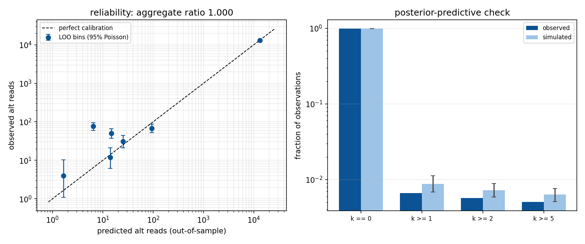

# Every assumption in the background model, and whether it holds

[`NOISE_MODEL.md`](NOISE_MODEL.md) says what the model *is*.
[`NOISE_MODEL_VALIDATION.md`](NOISE_MODEL_VALIDATION.md) shows it is calibrated.
Neither says what it **assumes**. This does, exhaustively, with the code location and the measured
consequence for each one.

Reproduce everything here with:

```bash
python3 bin/noise_model_validate.py \
  --tables 'results_cart_bnd/*/*.offtarget_analysis.tsv' \
  --queue-all results_cart_bnd/review/review_queue_all.tsv \
  --calib-seeds 20 --ks-bootstrap 200 --figdir docs/images
```

`--ks-bootstrap` is the parametric bootstrap of §Q1 (off by default; 200 sims ≈ 8 min). Sections
3b and 3c — the reliability check and the edited-vs-control assumption test — always run. Whole
thing is ~25 min.

---

## Summary — what actually turned up

Four findings change how the existing validation should be read, and one of them changes how the
model should be *described*. None is fatal; all are things a careful reader would find first.

| # | finding | consequence |
|---|---|---|
| 1 | **Assumption 8 — that the edited and control libraries share a background rate — was never tested. It holds wherever it can be tested.** Scored edited-against-control at no-edit loci and stratified by whether the caller reported an event: at the **91,984** event-free rows the p-values are uniform in the bulk (0.5026 at the median, 0.0557 at 0.05) and the raw posterior is already **conservative**, predicting 3.9× more background than the edited library shows. | The pooled **D = 0.0343** that first looked like a failure is a **selection artifact** — see [§ the follow-up](#follow-up--what-findings-1-and-2-actually-were). The depth floor then adds a further ~40× of conservatism on top. **Precision still comes from conservatism rather than from the Bayes, but because the filter is stacked twice over, not because the posterior is wrong.** |
| 2 | **The ~12× under-prediction at clean loci is five loci out of 6,822** (ratio 11.71, CI [9.23, 14.66] — real, but not general). Each is a single donor carrying a 15–26% VAF indel that the caller found, saw control support for, and **dropped as germline**; every other donor at those loci is clean. | Donor-private germline, which the other-donor null structurally cannot represent — this **is** assumption 25, quantified. Remove those loci and the model **over**-predicts (ratio 0.33, CI [0.13, 0.68]): the conservative direction. Not a prior-tail defect. |
| 3 | **The count distribution has the wrong shape**, even though its mean is exactly right. Observed zeros 0.9934 vs simulated 0.9912; observed max 130 vs simulated 105. | The two-process objection, visible as a distributional mismatch rather than a histogram. Mean-matching hid it. |
| 4 | **The calibration test does not exercise the regime production runs in.** The leave-one-donor-out null hands the model **4,523×** pooled control depth and a null that is 99.3% event-free; production uses **157×** from one matched control and scores rows that are 100% events. | Passing that test is necessary, not sufficient. A model that is catastrophic in production passes it comfortably — demonstrated below. |

**What survives unchanged:** the model is calibrated on the control-vs-control null it was tested
against, confirmed by a parametric bootstrap that handles both KS assumption violations at once
(p = 0.225), and no candidate replacement moves the review queue by more than the same single row.
The recommendation remains *do not change the shipped model* — but describe it accurately.

> **Findings 1 and 2 were followed up and both changed.** Neither is a defect in the prior. The
> table above already states the corrected versions; the working is in
> [§ Follow-up](#follow-up--what-findings-1-and-2-actually-were), and the original reasoning is
> left in place below so the correction can be checked rather than taken on trust.

And the answer to "why not just a Binomial per locus": at **86 of the 89** rows the AQ rule actually
sees, the matched control observed zero alt reads, so a plug-in `p̂ = 0` would score every one of
them at AQ = +∞. The test would pass everything.

---

## The seven questions

### Q1 — What does the Kolmogorov–Smirnov test assume?

Three things. One is satisfied, two are violated, **and the two violations push in opposite
directions**.

| assumption | status |
|---|---|
| Observations are **i.i.d.** under the null | **Violated.** 71,755 observations come from 6,876 loci, and at each locus every donor is scored against a background built from the *other donors at that same locus*. They are coupled by construction. |
| The null distribution is **fully specified** in advance | **Violated.** `a0, b0` are estimated by method of moments from the same observations the test then scores (`review_filter.py:365`). This is the Lilliefors problem. |
| The distribution is **continuous** | **Satisfied**, and handled properly. Discrete counts can never yield a uniform survival function, so randomised p-values `U·P(X=k) + P(X>k)` are used (`noise_model_validate.py:276`). |

**The two biases oppose each other.** Positive dependence makes the empirical CDF wander further
from uniform, inflating D. Estimating parameters from the same data makes the fitted distribution
track the data too closely, deflating D. Neither the size nor the net direction is knowable
analytically — so it was measured.

**The parametric bootstrap, which settles both at once** (`--ks-bootstrap 200`). Simulate 200
datasets under the fitted model with the **locus structure preserved** — one shared rate per locus,
which is precisely the dependence the null asserts — and **refit the prior by method of moments on
every synthetic dataset**, so the estimation bias is reproduced too. The spread of D across those
simulations is the null this test actually has:

```
null D under the fitted model : median 0.0029   95th pct 0.0051   max 0.0062
observed D (median seed)      : 0.0037          ->  bootstrap p = 0.225   PASS
```

**The two biases cancel almost exactly.** The bootstrap's 95th percentile, 0.0051, is
indistinguishable from the naive analytic critical value `1.358/√71755 = 0.0051` — and far below
the locus-level bound `1.358/√6876 = 0.0164`. So the naive number happened to be right, the
locus-level correction was sound but *loose*, and the honest statement is that neither analytic
route was trustworthy on its own; only the simulation shows they offset.

| model | median D over 20 seeds | vs bootstrap 95th pct (0.0051) |
|---|---:|---|
| Binomial, global `p` | 0.1398 | **REJECT**, 27× over |
| Beta-Binomial, MOM (**shipped**) | 0.0037 | **pass**, bootstrap p = 0.225 |
| Beta-Binomial, MML | 0.0038 | pass |
| Zero-inflated BB | 0.0038 | pass |

**What this does to the "1 seed in 20 rejects" caveat.** It explains it rather than dismissing it.
The worst seed (0.0062) does exceed 0.0051 — but so does the bootstrap's own maximum (0.0062) under
a model that is true by construction. Seed-to-seed variation of that size is what a correct model
looks like. **Report the median D (0.0037) and the bootstrap p (0.225); the worst seed is
randomisation variance, not evidence of misfit.**

> An earlier draft of this section claimed the locus-level accounting was the correct one and the
> naive one wrong. The bootstrap shows the effective null sits at the naive value. The conclusion —
> the shipped model passes, the Binomial fails — never changed, but the reasoning did.

### Q2 — What does conjugacy assume, and what does "closed form" buy?

**Conjugacy** means that a Beta prior combined with a Binomial likelihood yields a Beta posterior,
in the same family, with parameters obtainable by addition:

```
p ~ Beta(a, b)  and  k | p ~ Binomial(n, p)   ⇒   p | k ~ Beta(a + k, b + n − k)
```

and the marginal (what you predict a *new* observation with) is `BetaBinomial(n, a, b)`.

**What it assumes.** Only that the likelihood really is Binomial with a single `p` — i.e. that
reads at a locus are exchangeable Bernoulli trials at one rate. It assumes **nothing** about
whether the Beta is the right prior.

**What "closed form" buys.** An analytic posterior and predictive: no MCMC, no sampler, no
convergence diagnostics, deterministic output, and a cost of one `betabinom.sf` call per locus
across 99,238 of them. For a pipeline that must run unattended, that matters.

**What it costs, and this is the honest part.** Conjugacy is a *computational* property, not
evidence. It is a reason to prefer the Beta among priors that fit, never a reason to believe it
fits. And the cost is expressive: the shape the data actually has — a point mass at zero plus a
mode near 0.18, with **nothing in between** — cannot be written as a Beta. Staying conjugate means
accepting a family that cannot represent the population. §Q7-11 covers why it works anyway.

### Q3 — Why `α = a0 + control_alt` and `β = b0 + (control_depth − control_alt)`?

Because that *is* the conjugate update, and the reason it takes that form is the pseudo-count
interpretation: **`a0` behaves exactly like `a0` alt reads you already saw, and `b0` like `b0` ref
reads.** Real observations then simply add to the imaginary ones.

```
α = a0 + (alt reads in control)          β = b0 + (ref reads in control)
posterior mean = (a0 + alt) / (a0 + b0 + depth)
```

The fitted prior on this cohort is `Beta(0.002034, 1.639)`, so `a0 + b0 ≈ 1.64` — **the prior is
worth about 1.64 reads.** Any control deeper than ~2× overwhelms it immediately, which is the
intended behaviour: the prior exists to say something sane where there is no data, not to compete
with data where there is.

`control_reads − control_indel_reads` is the ref count because every read is alt or ref. That
identity is what makes the pair a valid `(successes, trials)` observation — and §Q7-4 is where it
breaks.

### Q4 — How is the per-locus update actually performed?

Four steps, in `bin/noise_model.py`:

1. **Fit the prior once** (`fit_global_prior`, `:100-118`) by method of moments over every control
   observation in the run.
2. **Update per locus** (`control_posterior`, `:191-217`) — pool the control counts at that locus
   under the chosen baseline and apply the conjugate update. Baselines: `matched` (this sample's
   own control only — **the production default**), `loo` (every *other* sample), `both` (all).
3. **Apply the depth floor** (`apply_depth_floor`, `:220-247`) — where the posterior mean fell
   below `1/control_depth`, relocate it to exactly `1/control_depth`, holding `α+β` fixed so only
   the location moves. **This step is not Bayesian**; see §Q7-19.
4. **Test the edited count** against the posterior predictive, one-sided, and Phred-scale it:

```python
AQ = -10*log10( betabinom.sf(k-1, n, alpha, beta) )       # review_filter.py:372-373
```

where `k, n` are the **edited** sample's counts and `alpha, beta` come entirely from the
**control**. Using the posterior predictive rather than a plug-in point estimate is the correct
Bayesian move — it integrates over the remaining uncertainty in `p` instead of pretending it is
known.

### Q5 — Why not just run a Binomial at every locus, since we have the actual probability?

**Because we do not have it.** We have an estimate from a control of median depth 157×, and at a
rate of 1e-3 that control *expects*:

```
157 × 0.00124 = 0.195 alt reads
```

So observing **zero is the single most likely outcome** at a locus whose true rate is exactly the
cohort average. The plug-in reads that zero as "the rate here is 0".

**What that does, measured.** Of the 89 rows that reach the AQ rule (rules 1–3 remove 390 of 479
before it), **86 — 96.6% — have `control_alt = 0`.** Under `p̂ = 0`:

```
P(X ≥ k | p̂ = 0) = 0   for every k ≥ 1     ⇒   AQ = +∞
```

**The test would declare 96.6% of the rows it sees infinitely significant, and filter nothing.**

The Beta-Binomial is not a different philosophy — **it is this model with the plug-in replaced by
an integral over the uncertainty in `p̂`**, and it converges to the plug-in as control depth → ∞.
At 157× for a rate of 1e-3 we are nowhere near that limit.

> **A result worth reporting because it went the other way.** Added as `BinomialPlugin` to the
> validation harness, the plug-in **passes** the leave-one-donor-out calibration test:
> D = 0.0047 against the shipped model's 0.0048, indistinguishable. It is not calibrated in any
> useful sense — it is calibrated *in that test*, because the test hands it **4,523×** of pooled
> other-donor depth (10.4 donors × ~157× each) and a null in which only **0.66%** of observations
> carry any event at all. Production gives it 157× from one control and scores rows that are 100%
> events. **A model that would filter nothing in production sails through the calibration test**,
> which is the sharpest available demonstration that passing that test is necessary and nowhere
> near sufficient. See §Q7-25.

### Q6 — Can we compare the calculated p to the observed p as a gut check?

Yes, and it is the most informative thing in this document. It has to be **out of sample** — a
locus's own control both builds and would be graded by its posterior, which is circular — so each
donor's rate is predicted from the *other* donors at that locus, reusing the existing LOO
structure.



**Aggregate: predicted 13,391.7 alt reads, observed 13,397 — ratio 1.000 ± 0.009.** Which looks
like a clean pass, and is why this was never noticed. It is carried almost entirely by one bin:
13,236 of the 13,392 predicted reads sit in the highest-expectation bin, the germline loci, where
the model is genuinely excellent.

Binned by **predicted expected count** (a rate bin can hold tens of thousands of observations
carrying no events, where a ratio is noise wearing a number's clothes):

| expected alt reads / obs | n | predicted | observed | ratio | 95% Poisson CI |
|---|---:|---:|---:|---:|---|
| [0, 1e-3) | 59,907 | 6.5 | 76 | **11.71** | [9.23, 14.66] |
| [1e-3, 3e-3) | 10,689 | 14.9 | 50 | **3.35** | [2.49, 4.42] |
| [1e-2, 3e-2) | 71 | 1.7 | 4 | 2.41 | [0.66, 6.17] |
| [3e-2, 1e-1) | 280 | 14.1 | 12 | 0.85 | [0.44, 1.49] |
| [1e-1, 3e-1) | 125 | 25.2 | 31 | 1.23 | [0.84, 1.75] |
| [3e-1, 1) | 163 | 93.6 | 68 | 0.73 | [0.56, 0.92] |
| [1, ∞) | 520 | 13,235.9 | 13,156 | 0.99 | [0.98, 1.01] |

**The two lowest bins under-predict by 12× and 3.4×, and both confidence intervals exclude 1.**
This is not a small-numbers artifact — it rests on 76 and 50 observed events.

> **Followed up, and the reading below is wrong.** The 76 events are 12 observations, and five
> loci carry 88% of the excess — each a donor-private allele the caller had already suppressed as
> germline. Removing them leaves a ratio of **0.33** [0.13, 0.68]: at genuinely clean loci the model
> **over**-predicts. See [§ Follow-up](#follow-up--what-findings-1-and-2-actually-were). The
> paragraph that follows is the original inference, kept so the correction can be checked.

The model looks systematically too optimistic about loci it believes are clean, which would be the
**false-positive** direction: a background predicted 12× too low produces an AQ far too high, at
exactly the sites where a call looks most convincing.

**Posterior-predictive check** — simulate `k ~ BetaBinomial(n, α, β)` per locus, 20 draws, and
compare the shape of the count distribution rather than its total:

| statistic | observed | simulated (95% band) | |
|---|---:|---|---|
| fraction k = 0 | 0.99338 | [0.99092, 0.99144] | **outside** |
| fraction k ≥ 1 | 0.00662 | [0.00856, 0.00908] | **outside** |
| fraction k ≥ 2 | 0.00570 | [0.00703, 0.00739] | **outside** |
| fraction k ≥ 5 | 0.00507 | [0.00631, 0.00640] | **outside** |
| mean k | 0.18670 | [0.18379, 0.19016] | ok |
| max k | 130 | [101.5, 110.6] | **outside** |

**The mean is exactly right and the shape is wrong.** The model spreads too little probability onto
zero, too much onto small non-zero counts, and too little into the extreme tail. That is the
two-process objection made quantitative: a single Beta cannot be simultaneously spiky enough at
zero and heavy enough at 0.5, so it compromises in the middle — and the middle is where no locus
actually lives.

**Caveat, stated rather than buried.** Both checks use the LOO (pooled) baseline, because that is
the only construction giving a genuine out-of-sample prediction. Production uses `matched`, a
single 157× control. The direction of the finding should transfer; the magnitudes are not directly
production numbers.

### Q7 — What else does the model assume?

Below, by layer. **Bold** entries are violated in a way that has a measurable or mechanical
consequence.

#### Read counting — `bin/find_edited_reads.py`

1. **Reads are independent Bernoulli trials.** Duplicates are filtered (`is_duplicate`, `:875`),
   but there is no UMI consensus and no correction for residual correlation. Overdispersion from
   this source is absorbed into the prior rather than modelled.
2. **Control alt is counted per READ; control depth per FRAGMENT.** `total_reads` is a `set()` of
   `query_name` (`:871`, added at `:878`, used at `:960`) so R1 and R2 of one fragment collapse to
   a single unit of depth; but `control_alt_counts += 1` (`:913`, `:921`, `:952`) runs inside the
   read loop with no such grouping. **An overlapping mate pair that both show the alt allele
   increments alt twice and depth once.** Direction: background biased **upward** ⇒ AQ too low ⇒
   over-filtering.
3. **The edited and control libraries are counted by different rules.** The edited sample is
   deduplicated to one row per fragment (`groupby('read').first()`, `:2189`); the control is not
   (#2). The numerator of the test and the null it is tested against come from different counting
   processes.
4. **`control_alt` is SUMMED over the events at a site while depth is a MEAN** of a single
   site-level constant (`:2242-2248`). The per-event alt counts are not a partition of the depth,
   so the pair need not satisfy `k ≤ n`. **3 of 99,238 rows have `control_alt > control_depth`.**
5. **Consequence of #4.** `control_posterior` computes `β = b0 + max(dep − alt, 0)`, so an
   impossible count does not raise an error — it produces `Beta(155.0, 1.64)`, a posterior with
   **mean 0.99**. The locus is declared 99% background and can never be called again. Verified on
   the one affected gated row, chr1:246,009,987: `bg_rate` 0.9895, AQ −0.0. Rule 1 removed it first
   as germline, so nothing changed *this* time. The mechanism is live regardless.
6. No strand-bias modelling anywhere in the caller or the noise model.

#### The locus model

7. One rate `p` per locus, constant across all reads covering it.
8. **The edited and control libraries share the same background rate.** The load-bearing
   biological assumption: `α, β` come entirely from control counts and are applied unmodified as
   the null for edited counts, with no library-specific term (`noise_model.py:386-415`). It was
   **asserted by construction and never tested** — the LOO calibration tests
   control-against-control. **It has now been tested, and it does not hold.** See
   [§ Testing assumption 8](#testing-assumption-8-the-one-nothing-checked) below.
9. **Loci are exchangeable under one global Beta.** Violated: sites in a ≥9 bp homopolymer carry
   control indel evidence 35.4% of the time against 0.53% in unique sequence. The multiplier is
   convention-dependent (33× under the run-length definition in the validation script, 72× under a
   window-clipped one) — the effect is robust, the exact number is not.
10. Loci are independent of one another. Nearby loci share reads, repeats and mapping behaviour.

#### The prior

11. **The Beta family is adequate.** Measured wrong: 99.40% of control observations sit at exactly
    zero, a second mode sits at 0.179, and **nothing lies between**. It works anyway because
    `a = 0.002 < 1` makes the Beta monotone decreasing — already spike-at-zero shaped — so it
    mimics zero-inflation. The explicit mixture is unidentifiable (π swings 0.536 → 0.993 while
    held-out likelihood moves 0.000002 nats).
12. **Method of moments takes the variance ACROSS observations**, which absorbs sampling noise as
    well as true locus-to-locus rate variation (`:103-105`, stated as intentional). The prior is
    therefore more diffuse than the real spread of rates warrants.
13. A degeneracy guard silently substitutes `Beta(100m, 100(1−m))` when `v ≥ m(1−m)` (`:114-116`).
    Not triggered on this cohort.
14. `MIN_PRIOR_MEAN = 1e-5` floors the fitted prior mean (`:81`), so a pristine-control cohort
    cannot drive it to zero.
15. **Empirical Bayes double-use of data.** Each locus's control counts enter the method-of-moments
    fit *and* are then added again to that same locus's posterior. Standard empirical-Bayes
    practice, but it understates uncertainty, and the effect grows as the cohort shrinks — a
    single-sample submission is the worst case.

#### The test

16. `(control_alt, control_depth)` is a valid `(successes, trials)` pair — violated by #4.
17. The posterior predictive is the right null for the edited count. Correct, *conditional on* #8.
18. **The test is one-sided** — `sf(k-1, ...)` = `P(X ≥ k)`. It can only ask "is there too much
    signal", never "is this locus improbably clean", so a locus that has lost coverage or been
    over-filtered upstream cannot be flagged.
19. **The depth floor is not a Bayesian operation.** It relocates the posterior mean post hoc to
    `1/control_depth`. It **raises the background on 306 of 479 gated rows (63.9%)** and moves the
    median AQ from 31.1 to 4.1 — the single most consequential step in the whole model. It is
    defensible (it encodes what a control of that depth can resolve) but it is a patch, and it is
    doing more work than the prior.
20. AQ is capped at 3000 by the `1e-300` clip in `aq_from_sf` (`:250-253`).
21. **`AQ_MIN = 5` was chosen to reproduce the legacy panel-of-normals output**, per its own comment
    (`review_filter.py:73-76`) — 3, 5 and 8 all matched, 10 lost a confirmed edit, and 5 sits mid
    plateau. It is not derived from a target false-positive rate.
22. **No multiple-testing correction.** `noise_model.py:423-426` prints an expected-false-positive
    count at several thresholds and never feeds it into any decision.
23. **Rule ordering.** AQ is 4th in a first-match-wins `np.select`, so it only ever sees the 89 of
    479 gated rows that rules 1–3 spared. Any evaluation over all 479 overstates its reach ~5×.

#### The validation itself

24. The KS assumptions — §Q1.
25. **The LOO null does not reproduce the production regime.** It pools ~10 donors (median 4,523×
    of control) where production uses one (157×), and 99.34% of its observations carry no event
    where every production row does. Demonstrated live by `BinomialPlugin` passing it (§Q5). It
    also uses other donors as a proxy for this donor, which is sound for machine error and wrong
    for germline — donor-private variants are, by definition, not in anyone else.

---

## Testing assumption 8 — the one nothing checked

The model builds its null entirely from the control library and applies it to the edited library.
Nothing verified that those two libraries share a background rate. This tests it directly.

> **Followed up, and the headline number does not survive.** The pooled D = 0.0343 comes from
> mixing 2,937 rows that carry a *called* indel into 91,984 that do not. Conditioning on "an event
> was called here" forces `k ≥ 1`, which turns the p-value into a spike at ≈0.001 rather than a
> distribution. On the event-free rows — where the assumption can actually be tested — the
> p-values are uniform in the bulk (0.5026 at the median). See
> [§ Follow-up](#follow-up--what-findings-1-and-2-actually-were). The section below is the
> original analysis, kept intact so the correction can be checked; its **depth-floor** measurements
> stand and in fact strengthen.

**Design.** Take every site-row with `is_target == 0` — no nominated cut site, so no edit is
expected — and score the **edited** counts against that sample's **own matched control**, exactly
as production does. Convert to randomised p-values. If the two libraries share a background, those
p-values are Uniform(0,1). 94,921 rows qualify.

**Result — the raw posterior, i.e. the Bayesian model itself:**

| | observed | expected if the assumption holds |
|---|---:|---:|
| KS D | **0.0342** | ~0.003 (what control-vs-control gives) |
| fraction p < 0.001 | **0.01022** | 0.001 — a **10.2× excess** |
| observed / predicted alt reads | 0.855 | 1.0 |

**D = 0.0342 is seven times the control-vs-control figure (0.0037) and nearly seven times the
bootstrap's 95th percentile (0.0051).** The assumption fails in the comparison the pipeline
actually performs.

> As in §Q1, **D is the stable statistic and the tail-excess figure is not** — it moves by about a
> point between randomisation draws (10.2× here, 11.2× on an independent implementation) while D
> holds to three decimals. Read the excess as "roughly an order of magnitude too many".

**It is not explained by real edits.** Some `is_target == 0` rows could carry genuine off-target
editing, which would produce legitimately small p-values. Excluding every row that could possibly
be called — anything with ≥2 alt reads at VAF ≥ 0.005, i.e. the entire gate — barely moves it:

| population | n | KS D | p < 0.001 excess |
|---|---:|---:|---:|
| all no-target rows | 94,921 | 0.0342 | 10.2× |
| **sub-gate only — cannot be a call** | 94,523 | **0.0320** | **7.9×** |
| zero edited alt reads | 91,209 | 0.0039 | 0.0× |

The middle row is the meaningful one: rows that are background *by construction of the gate* still
carry **7.9× too many extreme p-values**. (The last row looks perfect only because conditioning on
`k = 0` makes the randomised p-value uniform by construction — it is included to show it is
uninformative, not as evidence.)

**What is actually going wrong.** The direction is the tell: overall the edited sample has *fewer*
alt reads than predicted (ratio 0.856), yet the extreme tail is heavily over-populated. That is not
a library running uniformly hotter — it is the same **clean-locus under-prediction** measured in Q6.
Where the control saw nothing, the raw posterior claims a background near `a0/(a0+b0+depth) ≈ 1e-5`,
so one or two alt reads in the edited sample look extraordinary. The failure is concentrated at
precisely the loci the model is most confident about.

**And this is what the depth floor is for.** Re-running the same test with the floor on, as
production has it:

| | raw posterior | with depth floor (production) |
|---|---:|---:|
| KS D | 0.0342 | **0.4814** |
| fraction p < 0.001 | 0.01022 (10.2× too many) | 0.00012 (8× too **few**) |
| observed / predicted alt reads | 0.855 | **0.040** |

The floor does not calibrate the model — **it over-corrects by a factor of ~25**, declaring a
background 25× larger than the edited sample actually shows. It raises the background on 94,435 of
these 94,921 rows.

**The honest conclusion, and it matters for how the model is described.** In the comparison
production performs, the shipped configuration is **not calibrated in either direction** — the
Bayesian posterior is far too aggressive, and the depth floor that patches it is far too
conservative. What delivers the observed precision is **the conservatism of the floor, not the
Bayesian machinery underneath it.** The model's calibration credential comes from a
control-vs-control test that does not exercise this comparison at all (§Q7-25).

That is not an argument for abandoning it — a deliberately conservative filter with 64/64 recall is
a perfectly respectable instrument, and being conservative is the right failure direction for a
screen. It is an argument for describing it accurately: **it is a conservative bound, not a
calibrated probability**, and the AQ values it reports should not be read as p-values in the
edited-vs-control sense.

**Caveats.** Off-target rows may include an unknown number of genuine edits, though the sub-gate
result bounds their contribution. And the comparison uses a single matched control per row, which
is the production configuration but also the thinnest one.

## Follow-up — what findings 1 and 2 actually were

Findings 1 and 2 above were the two that pointed at a defect in the model rather than in its
description, so both were chased to a cause. Neither survived. Everything below is reproduced by

```
bin/noise_model_followup.py --tables 'results_cart_bnd/*/*.offtarget_analysis.tsv' \
    --fasta .../hg38_PLVM_CD19_CARv4_cd34.fa --part both
```

which, like `noise_model_validate.py`, is analysis only — it imports the shipped model, changes
nothing, and the pipeline never calls it.

### Finding 2 — the clean-locus under-prediction is five loci

The coldest reliability bin under-predicts by 11.71×. That ratio is computed over **59,907
observations, of which 12 carry any alt read at all** — and five loci carry 88% of the excess:

| locus | donors in bin | predicted | observed alt | VAF | events the caller suppressed |
|---|---:|---:|---:|---:|---:|
| chr12:131,404,130 | 1 | 0.001 | 29 | 0.257 | 1 |
| chr21:41,062,284 | 1 | 0.001 | 25 | 0.217 | 1 |
| chr8:85,438,605 | 1 | 0.001 | 21 | 0.198 | 1 |
| chr8:1,858,151 | 1 | 0.001 | 20 | 0.163 | 2 |
| chr17:14,952,680 | 1 | 0.001 | 16 | 0.145 | 1 |

Every one is a *single* donor with a 15–26% VAF indel while every other donor at that locus is
clean — and in every case the caller **found the event, saw control support, and dropped it** at
`-x 0` (`find_edited_reads.py:2286`). The last column is the `n_control_filtered` the caller
records. Across the whole no-target set the association is not subtle: **100% of rows with control
VAF ≥ 5% and a near-empty edited library have `n_control_filtered > 0`, against 0.39% elsewhere.**

So these are real donor-private alleles that the leave-one-donor-out null cannot represent, because
the null is built from *other* donors and germline is donor-private. That is
[assumption 25](#the-validation-itself) exactly, already documented as a known limitation, showing
up with a number attached.

The three competing explanations were tested and are not it:

| hypothesis | prediction | result |
|---|---|---|
| germline at VAF ~0.5 | excess at VAF ≥ 0.35 | **0** observations there; the outliers sit at 0.15–0.26 |
| sequence context | excess in long homopolymers | 96.4% of the excess is in runs **< 5 bp** |
| batch effect | NS0065 controls globally noisier | rate 0.00109 vs 0.00107 elsewhere; **NS0027 is the highest** at 0.00161 |

**Strip the ten worst loci, anything germline-like, and any homopolymer ≥ 7 bp, and 70,334
observations remain with a ratio of 0.33, 95% CI [0.13, 0.68].** At genuinely clean loci the model
**over**-predicts the background threefold. The prior's left tail is not too thin; if anything it is
too thick, which is the safe direction for a filter.

### Finding 1 — assumption 8 was measured on a population selected for the outcome

The pooled D = 0.0343 is real arithmetic, but it is not a calibration measurement. Stratify the
same 94,921 rows by whether the caller reported an indel at that site:

| population | n | share | KS D | p < 0.001 | obs/pred |
|---|---:|---:|---:|---:|---:|
| `indel_count == 0` — no event called | 91,984 | 96.9% | **0.0079** | 0.00187 (1.9×) | 0.254 |
| `indel_count == 1` — one event called | 2,651 | 2.8% | **0.9476** | 0.287 (287×) | 1.830 |
| `indel_count ≥ 2` | 286 | 0.3% | 0.4674 | 0.465 (465×) | 1.050 |
| **pooled — as originally reported** | 94,921 | | 0.0343 | 0.0112 | 0.856 |

**D = 0.9476 is not a miscalibration, it is a tautology.** `indel_count == 1` means an event was
called at that site, so 100% of those rows have `k ≥ 1` by construction. Against a background near
`1e-5` every such row scores p ≈ 0.001–0.003 — the median is 0.0013 and 95% fall below 0.01. That
is a **spike at one value**, not a distribution, and a KS statistic computed on it measures the
selection, not the model. Pooling those 3.1% of rows into the other 96.9% is what produced 0.0343.

On the rows where the assumption *can* be tested — where nothing was called, so nothing is selected
— the p-values are close to uniform:

| | observed | uniform |
|---|---:|---:|
| P(p < 0.5) | 0.5026 | 0.5 |
| P(p < 0.05) | 0.0557 | 0.05 |
| P(p < 0.01) | 0.0164 | 0.01 |
| P(p < 0.001) | 0.00187 | 0.001 |

The bulk is uniform to three decimals. A residual ~1.9× sits in the extreme tail and D = 0.0079 is
still above the naive critical value (0.0045) — so this is "supported", not "proven". But it is not
the seven-fold failure originally reported.

Two further controls: removing the germline-suppressed rows does **not** move it (D 0.0343 →
0.0345), so finding 2 is not the cause of finding 1 — they are separate; and the original sub-gate
population did not isolate the effect because most called events sit below the gate.

**What this does not settle.** It tests the assumption only where no event was called. At rows that
*do* carry a called event — the rows the filter actually adjudicates — the assumption remains
untestable by this route, because that population is selected on the outcome. The right statement
is *supported where testable, untestable where it bites.*

### What survives from the original conclusion

The depth-floor measurement stands and gets stronger on the cleaner stratum:

| | raw posterior | with depth floor (production) |
|---|---:|---:|
| all no-target — obs/pred | 0.856 | 0.040 |
| **event-free rows — obs/pred** | **0.254** | **0.006** |
| event-free rows — KS D | 0.0079 | 0.4996 |

The raw posterior is already conservative on the event-free stratum, predicting **3.9× more**
background than the edited library shows. The floor then multiplies that by a further ~40×. So
**"precision comes from conservatism rather than from the Bayesian machinery" survives** — but the
mechanism is the opposite of what was first written. The posterior is not too aggressive and being
rescued by the floor; it is already conservative, and the floor stacks a second, much larger margin
on top of it. AQ remains a conservative bound rather than a calibrated edited-vs-control p-value,
and should still be described that way.

## What to do about it

Ordered by value, and none of it is applied here — this document changes no code.

1. ~~**Fix the control counting asymmetry (#2, #3).**~~ **DONE, and its impact is measured and
   small.** `add_normal_counts` now accumulates supporting **fragment names** in a set and reports
   `len(...)`, so alt support is fragment-level exactly as depth already was. Regression tests in
   `tests/test_control_counts.py` (they fail against the old code: 8 counted where 5 fragments
   exist).

   **How much it actually changes.** Counting alt-supporting reads vs alt-supporting fragments
   directly on control CRAMs at 12 real gated loci, the reduction is **5–14%** — e.g. 63→59,
   75→69, 21→18. That is far below the ~49% mate-overlap rate among *all* fragments, because both
   mates must independently carry the indel *at that exact position* to double-count, which is
   much rarer than merely overlapping. **No locus among the 12 crosses the rule-1 threshold.**

   Cohort-wide bound: of the 154 rows rule 1 drops as germline, the median control VAF is 0.201 —
   four times the 0.05 cut — and only **8 sit within 20% of it**. So a 5–14% reduction moves
   **1–8 rows of 479** back into the queue, and **recall cannot regress**: the fix only lowers the
   background, so rows can move *into* the queue but no confirmed edit can be dropped.

   **A re-run is therefore not urgent.** Fold it into the next scheduled cohort run rather than
   spending ~5 h now; every number in these docs predates the fix and would shift by at most that
   much.
2. ~~**Test assumption #8.**~~ **DONE, and it fails** — see
   [§ Testing assumption 8](#testing-assumption-8-the-one-nothing-checked). The practical
   consequence is a description change, not a code change: AQ is a conservative bound, not a
   calibrated probability in the edited-vs-control sense.
3. ~~**Investigate the clean-locus under-prediction (Q6).**~~ **DONE — it is five loci, and it is
   germline.** See [§ Follow-up](#follow-up--what-findings-1-and-2-actually-were). Five loci of
   6,822 carry 88% of the excess, each a donor-private allele the caller had already suppressed;
   remove them and the model over-predicts (0.33, CI [0.13, 0.68]). The assumption-8 corroboration
   was independent of it and was itself a selection artifact. **No code change follows.** The one
   thing worth carrying forward is a documentation point: the LOO reliability diagram cannot be
   read at the cold end without excluding rows with `n_control_filtered > 0`, because those rows
   are germline by construction.
4. **Condition the prior on sequence context (#9).** Largest measured context effect, computable
   from the FASTA at zero cost, and currently free — no queue row sits in a long homopolymer. Fix
   it before a cohort with homopolymeric targets makes it expensive.
5. **Leave the depth floor alone (#19)** until the zero-inflation ε can be sourced from the panel.
   The principled replacement needs a number the matched control cannot supply.
6. **Do not change the shipped model on this evidence.** Every Beta-Binomial variant still moves
   the queue by the same single row, and recall is 64/64 against the curated label for all of them,
   including the models that are statistically worse.
