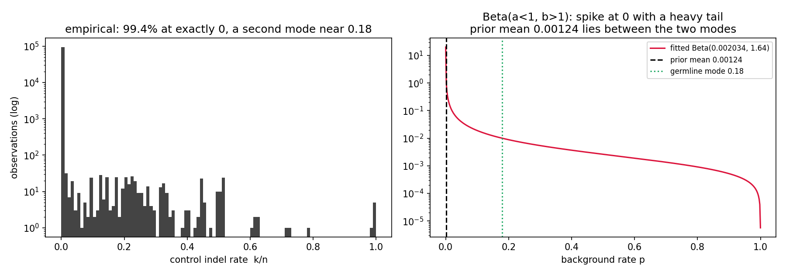

# Does the background model describe the data?

The model was described verbally and the objection raised back was, in substance, that it **mushes
two physically distinct processes into a single distribution**:

- **Machine physics** — sequencing, PCR and alignment error. A per-base Bernoulli process whose
  rate is tiny, is *not* globally fixed, and varies with the physical sequence context.
- **Biology** — germline variation in the donor. Not error at all: a real allele near VAF 0.5 or
  1.0, and specific to *that* donor.

A single Beta fitted across both is being asked to describe a population that does not exist.

**That reading of the data is correct, and this document confirms it directly.** What it also
shows — and this is the part that was not expected — is that the mis-specification does **not**
produce the failure it should, for a specific and interesting reason. The findings do not all point
the same way, and they are reported here in the order they came out rather than sorted to support a
conclusion.

Everything below is reproducible with:

```bash
python3 bin/noise_model_validate.py \
  --tables 'results_cart_bnd/*/*.offtarget_analysis.tsv' \
  --queue-all results_cart_bnd/review/review_queue_all.tsv \
  --truth-wgs '.../cart_wgs_merged.xlsx' \
  --fasta .../hg38_PLVM_CD19_CARv4_cd34.fa \
  --figdir docs/images --calib-seeds 20
```

`--calib-seeds` controls the seed sweep in §3; the expensive per-observation tail is computed once
per model and only the uniform draw is repeated, so raising it is nearly free. Runtime ~6 min. See [`NOISE_MODEL.md`](NOISE_MODEL.md) for what the model *is*.

---

## Summary of findings

| # | question | answer |
|---|---|---|
| 1 | Are there two populations? | **Yes, unambiguously.** 99.4% at exactly zero, a second mode at 0.18, nothing between. |
| 2 | Does a better model fit better? | Marginally. Binomial is catastrophic; the three Beta-Binomial variants are within 0.003 nats. |
| 3 | Is the shipped model *calibrated*? | **Yes, by effect size.** KS D ≈ 0.004 against a genuine null vs **0.140** for the Binomial — a 35× gap, stable across seeds. (The KS *p*-value is seed-dependent and should not be quoted; see §3.) |
| 4 | Is the error rate context-dependent? | **Yes, strongly.** ≥9 bp homopolymers run at **33×** the cohort rate. |
| 5 | Is the depth floor a patch? | Yes in origin — but the explicit alternative is unidentifiable, so it stays. |
| 6 | Does any of it move the queue? | **No.** Every Beta-Binomial variant drops the same 1 row. |

**The headline, stated plainly:** the objection is physically right and statistically inert on this
cohort. The two populations are real and visible; the sequence-context effect is real and large;
but the shipped prior's *shape* already absorbs both well enough that no candidate replacement
changes a single call. The one genuine gap — the sub-detection machine-error rate — cannot be
closed with a matched control at all, and that is where the DRAGEN panel has a principled role.

---

## 1. The two populations

Over the 95,073 site-rows carrying control depth:

```
zero control alt reads : 94,502 / 95,073 = 99.40%
nonzero                : 571    median 0.179   q25 0.039   q75 0.292
smallest nonzero rate  : 0.004695   (= 1 read at that depth)

observations in (0,     0.001) : 0
observations in (0.001, 0.01 ) : 89
observations in (0.01,  0.05 ) : 61
```

**There is nothing between the two modes.** Not "few" — zero observations in (0, 0.001), and the
smallest nonzero rate is exactly one read. This is a point mass at zero (machine error, below
detection) plus a germline mode (biology), and nothing in between that a continuous unimodal
distribution could be describing.



Method of moments matches a mean and a variance. Applied to this mixture it returns
`Beta(0.002034, 1.639)`, whose mean of **0.00124 sits between the two modes, where no locus lives**.
The fit is not badly tuned; on its face it is fitting a population that does not exist.

### Why the control cannot see the machine-error rate

Median control depth is **157×**, so one read is **0.64% VAF**. The matched control physically
cannot resolve an error rate below that. Everything the machine-error process actually does lives
underneath the detection limit, and the zero bin is that limit, not a measurement of zero.

**This is the real reason the ad-hoc depth floor exists** (§5), and the real argument for the panel
(§7).

### Data hazards, handled explicitly

- **4,165 rows have zero control depth.** They keep the global prior; there is no depth from which
  to derive a floor.
- **3 rows have `control_indel_reads > control_reads`.** The caller *sums* alt counts over the
  events at a site but takes the *mean* of control depth, so these are not a clean `(k, n)` pair
  and `betabinom` is undefined for `k > n`. The script clips `k` to `n` by default
  (`--kn-policy drop` to exclude them instead); at 3 rows the choice changes nothing, but it is a
  choice and it is recorded.

## 2. Model comparison — held-out log predictive likelihood

Split **by locus** (so a locus cannot appear in both halves): 47,527 train / 47,546 test over
30,194 distinct loci. Higher is better.

| model | fitted parameters | held-out mean log-lik |
|---|---|---:|
| Binomial, global `p` | p = 0.00123 | **−1.0293** |
| Beta-Binomial, MOM prior (**shipped**) | Beta(0.00268, 2.151) | −0.0562 |
| Beta-Binomial, max marginal likelihood | Beta(0.00142, 1.295) | −0.0530 |
| Zero-inflated Beta-Binomial | π=0.536, ε→0, Beta(0.0031, 1.30) | −0.0530 |

**The Binomial is catastrophically worse — 18× the loss per observation.** That is the single
clearest quantitative vindication of using a compound distribution at all, and it settles "why not
just use an error rate?" on its own.

**The three Beta-Binomial variants are indistinguishable.** Proper empirical Bayes (max marginal
likelihood) buys 0.003 nats over method of moments. The explicit two-component mixture buys
0.000002 nats over that — i.e. nothing.

### The mixture is not identifiable, and that is the explanation

Fitting the zero-inflated model on the training half gives π = 0.536; fitting it on all the data
gives π = **0.993**. The mixing weight swings by a factor of two while the held-out likelihood does
not move at all.

The reason is in the shape of the shipped prior. **A Beta with `a < 1` is already spike-at-zero
shaped** — its density is infinite at `p = 0` and decreasing throughout. So the "clean" component
and the low end of the Beta component explain the same observations, and the data cannot apportion
between them.

**The explicit mixture is re-describing what the fitted prior's shape already encodes.** That is
why the conflation of two processes does not produce the failure it should: method of moments,
applied to a bimodal population, happened to land on a family member whose shape mimics zero
inflation. The criticism is right about the population and wrong about the consequence.

## 3. Calibration

The decisive test, and it needs no new data. **Score each donor's own control counts against the
other donors' controls at the same locus.** Both sides are unedited material, so anything that
scores as signal is a miscalibration by construction. 6,876 loci carry ≥2 donors; 71,755
observations.

> **Why randomised p-values.** With discrete counts the ordinary survival function *cannot* be
> Uniform even under a perfect model — it is bounded below by P(X = k), and with 99% of
> observations at k = 0 the mass piles at 1. The randomised p-value `U·P(X = k) + P(X > k)` with
> `U ~ Uniform(0,1)` is exactly uniform under a correct discrete model, and is what makes this test
> meaningful at all. A naive QQ plot here would look broken for every model, including a correct one.

> **A randomised test must be reported as a range, not a number.** Every p-value below is one
> *draw*. Re-running with a different seed gives a different answer, and at n = 71,755 the KS
> p-value swings across nearly the whole unit interval while the KS **D** statistic barely moves.
> So D is the statistic to read and p is not; the table reports both, swept over 20 seeds
> (`--calib-seeds`). All models are scored on the **same** draws, so differences between rows are
> differences between models rather than between random states.

| model | KS D (seed 0) | mean | frac < 0.05 | frac < 0.001 | **D over 20 seeds** | **KS p over 20 seeds** | rejects at 0.05 |
|---|---:|---:|---:|---:|:---:|:---:|---:|
| *(calibrated)* | 0 | 0.500 | 0.0500 | 0.00100 | — | — | 1/20 expected |
| Binomial, global `p` | **0.1400** | 0.574 | 0.0060 | **0.00523** | 0.1383 – **0.1398** – 0.1414 | 0.000 – 0.000 – 0.000 | **20/20** |
| Beta-Binomial, MOM (**shipped**) | 0.0048 | 0.501 | 0.0508 | 0.00169 | 0.0028 – **0.0037** – 0.0062 | 0.009 – 0.277 – 0.624 | 1/20 |
| Beta-Binomial, MML | 0.0047 | 0.501 | 0.0510 | 0.00183 | 0.0028 – **0.0038** – 0.0062 | 0.007 – 0.242 – 0.629 | 2/20 |
| Zero-inflated BB | 0.0048 | 0.501 | 0.0510 | 0.00188 | 0.0028 – **0.0038** – 0.0063 | 0.007 – 0.238 – 0.614 | 2/20 |

(ranges are min – **median** – max)


**The shipped Beta-Binomial is calibrated, and the honest way to say so is by effect size.** Its
deviation from Uniform is D ≈ 0.003–0.006 depending on the draw, against **0.1398** for the
Binomial — a **35× gap that is stable at every seed**, and the part of this result that carries no
caveat at all. That is the finding: it did not go the way the objection predicted.

**What cannot be claimed is a clean pass on the p-value.** One seed in 20 rejects at α = 0.05 for
the shipped model — which is exactly the false-positive rate a *correct* model should show, but it
means "p = 0.08, it does not reject" was never a property of the model, only of seed 0. At
n = 71,755 a KS test resolves deviations far too small to matter, so a marginal p here reflects
sample size, not misfit. **Quote D, not p.** An earlier version of this table quoted a single
seed's p-value and is superseded.

> **A correction this exposed.** That earlier table also showed MML at D = 0.0025 against MOM's
> 0.0047 and bolded MML as the best-calibrated model. That gap was **an artifact of the random
> draws**, not a real difference: the models were scored on independently drawn p-values rather
> than shared ones. Scored on the same draws, all three Beta-Binomials land within 0.0001 of each
> other at every seed. This *strengthens* §2's conclusion — the variants are indistinguishable by
> held-out likelihood **and** by calibration — but the earlier ranking should not be repeated.

**The Binomial fails badly, and in the specific way that matters.** It produces **5.2× too many
p-values below 0.001** while producing 8× too *few* below 0.05. That is the exact failure mode the
model was built to avoid: a fixed `p` is systematically overconfident in the extreme tail, which is
the only region a variant filter reads.

Stratifying by the conditions where mis-specification should bite hardest — thin donor support, and
control depth above/below the median — the shipped model stays calibrated in every stratum
(D ≤ 0.017). The worst stratum is thin support (1 other donor, D = 0.0162, n = 2,926), where the
prior dominates; that is the expected direction, and the size is small. Deep controls (≥ 157×,
D = 0.0083) are mildly worse than shallow ones, consistent with §1: more depth means more
opportunity to resolve the germline mode the single prior is not shaped for.

## 4. Sequence context

**This is where the objection is confirmed outright.** The Bernoulli rate is not a constant of the
assay. Homopolymer run length was derived from the reference FASTA with `pysam`
(longest run overlapping ±12 bp of the site, measured at full length rather than clipped to the
window):

| stratum | n | observed rate | fitted prior mean | % nonzero |
|---|---:|---:|---:|---:|
| no run (≤3 bp) | 60,761 | 0.001177 | 0.001163 | 0.53% |
| 4–5 bp | 32,037 | 0.001107 | 0.001276 | 0.56% |
| 6–8 bp | 2,162 | 0.000572 | 0.000495 | 1.39% |
| **≥9 bp** | **113** | **0.039231** | **0.040122** | **35.40%** |

**Sites in a ≥9 bp homopolymer carry indel evidence in the unedited control 35.4% of the time
against 0.53% in unique sequence (67× more often), at an indel rate of 0.0392 against 0.0012
(33× higher).** A single global prior necessarily
under-penalises that context and over-penalises clean unique sequence. The worked example in
[`NOISE_MODEL.md`](NOISE_MODEL.md#5-a-worked-example-end-to-end) is exactly this case: a 15 bp T
homopolymer whose four "events" are ±1–2 T slippage.

Two honest caveats:

- **The trend is not monotone below 9 bp.** The 4–5 and 6–8 strata are not separated from the
  baseline by rate (6–8 is actually *lower*), only by the fraction of nonzero observations. The
  effect is a threshold at long runs, not a smooth gradient.
- **n = 113 in the top stratum.** The effect size is large enough that this is not a sampling
  fluke, but the stratum-specific prior is fitted on little data.

### What it would cost — nothing, today

| stratum | gated rows | rows in the queue |
|---|---:|---:|
| ≤3 bp | 271 | 76 |
| 4–5 bp | 136 | 10 |
| 6–8 bp | 36 | 0 |
| ≥9 bp | 36 | **0** |

**No queue row sits in a ≥9 bp homopolymer.** All 36 gated rows in that stratum are already removed
by earlier rules. The mis-specification is real, large, and currently free — which is an argument
for fixing it before it costs something, not for fixing it now.

## 5. The depth floor

Ablated on the 479 gated rows:

```
floor raises the background on 306 of 479 rows (63.9%)

posterior mean WITHOUT the floor, on those rows:  min 3.5e-06, median 2.0e-05
the fitted prior mean is                          1.2e-03
1 / median control depth is                       6.4e-03
```

**Left alone, the posterior claims a background rate ~300× below what a 157× control can support.**
That is the clean-control trap: with `α = a0` and `β = b0 + d`, the mean collapses to `a0/(a0+d)`,
which says "the rate here is essentially zero" on the basis of a control that simply never sampled
deeply enough to say anything.

The floor exists because **a single Beta has no way to say "this locus is clean; the true rate is
below what this control can resolve."** It is forced to extrapolate, produces an absurd number, and
the floor clamps it.

The prediction was that an explicit zero-inflation component would make that statement
representable and render the clamp unnecessary. **It does make the statement representable —** the
mixture puts weight π = 0.993 on a component at rate ε — **but it does not make the clamp
unnecessary, because ε is not estimable.** The MLE drove ε to the denormal floor (10⁻³²⁴). No
observation constrains it from below: at 157×, a rate of 10⁻⁴ and a rate of 10⁻⁴⁰ both predict zero
alt reads with probability ≈ 1.

**So the floor stays.** It encodes `1/d` as the resolution limit, which is a defensible statement
about what the data can support, and the principled alternative reduces to needing a number the
data does not contain. This is a case where the ad-hoc patch turns out to be the honest option, and
the right fix is to get ε from somewhere else entirely (§7).

## 6. Operational consequence

The AQ rule is 4th in `review_filter.py`'s `np.select`, and first match wins — so it only ever sees
rows that rules 1–3 left alone. Of 479 gated rows, rules 1–3 remove 390; **89 rows reach the AQ
test**, 74 of them labelled (64 confirmed / 10 rejected).

| model | AQ<5 drops | surviving | confirmed | rejected |
|---|---:|---:|---:|---:|
| Binomial, global `p` | 0 | 89 | 64/64 | 10/10 |
| Beta-Binomial, MOM (**shipped**) | 1 | 88 | 64/64 | 9/10 |
| Beta-Binomial, MML | 1 | 88 | 64/64 | 9/10 |
| Zero-inflated BB | 1 | 88 | 64/64 | 9/10 |

**Every Beta-Binomial variant drops the same single row.** Recall against the curated label is
64/64 for all four models, including the Binomial.

> Scoring all 479 gated rows instead would show 151–282 rows below AQ 5 and look like a large
> effect. It is not: most of those rows never reach this test in the shipped pipeline. Any future
> comparison must use the 89, or it will overstate the model's reach by a factor of five.

A model that is statistically better but moves the queue by zero rows has not earned a pipeline
change. **No change to the shipped default is recommended on this evidence.**

## 7. What to actually do — each component gets the prior only the right instrument can supply

The two processes need two different kinds of prior, and the reason the current model has a soft
spot is that one instrument is being asked to supply both.

**Germline / real-allele component → the matched control.** A donor's genotype is a property of
that donor. The correct prior for "is there a real allele here in *this* person" can only come from
*this* person's own unedited material. A 46-donor panel reports a population average and is
structurally incapable of representing one donor's genotype, at any panel size. This is a category
distinction, not a tuning failure — and it is [measured directly](PANEL_AS_FILTER.md#can-the-panel-stand-in-for-rule-1):
the panel misses **64% of the germline calls rule 1 catches**, and the ones it does see are
typically single-donor coincidences.

**Sub-detection machine-error component → the DRAGEN panel.** This is where the panel intuition is
right and should be adopted. Sub-detection error rate is donor-independent physics — the polymerase
slips the same way in every sample — so pooling donors is legitimate in a way it never is for
germline. One control at 157× cannot resolve it (§1) and the mixture's ε is unestimable from it
(§5); 46 donors pooled can. **The panel is the better instrument for exactly the component the
matched control is blind to**, and `noise_model.py` already has a `panel` baseline to build from.

**Sequence context → the reference, not either instrument.** The 33× homopolymer effect (§4) is
computable from the FASTA at zero cost and needs no panel and no control. If any of this is
implemented, that is the cheapest piece and the one with the clearest physical basis.

### Priority, given that nothing changes the queue today

1. **Nothing urgent.** No candidate model moves a single call on this cohort. Say so.
2. **Context-conditioned prior** — largest measured effect (33×), cheapest to compute, currently
   free because no queue row is affected. Fix it before a cohort with long homopolymer targets
   makes it expensive.
3. **Panel-derived ε** — the only principled route to the machine-error component, and the answer
   to "why not use the panel?" that is actually true.
4. **Leave the depth floor alone** until 3 exists. It is currently the honest option.
