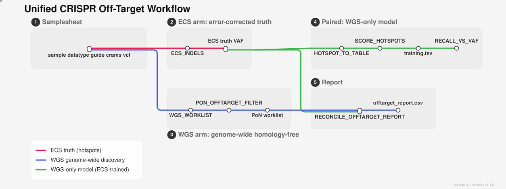
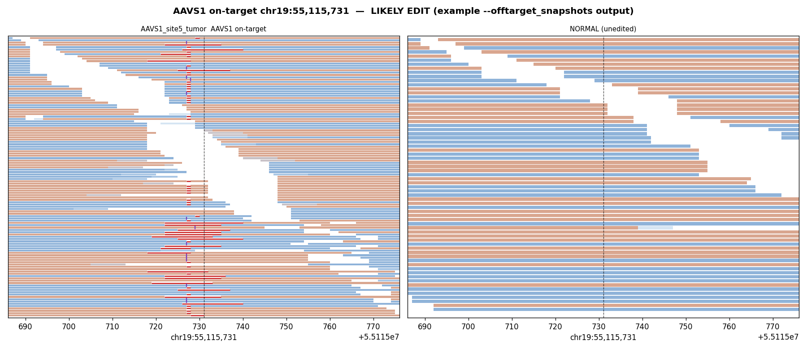

# Unified CRISPR Off-Target Workflow

A self-contained arm added to nf-core-scge on branch `feat/offtarget-wgs`. It runs
via a **named entry** (`-entry OFFTARGET`) and **does not touch the default SCGE pipeline**.

(2026-07-09): the legacy `crispr_ml_*` read-level classifier is **deprecated** for
off-target work; this workflow uses the pileup shape-model approach
(`worklist_from_vcf` / `pon_filter` / `score` + `wgs_shape_model.pkl`).

<picture>
  <source media="(prefers-color-scheme: dark)" srcset="images/offtarget_metro_dark.svg">
  
</picture>

*Three lines: **ECS truth** (red) at hotspots, **WGS genome-wide discovery** (blue) → PoN-filtered
worklist, and the **WGS-only model** (green) that joins WGS features to ECS truth. Source:
[`offtarget_metro.mmd`](offtarget_metro.mmd) (rendered with [nf-metro](https://github.com/seqeralabs/nf-metro);
an interactive pan/zoom version is at [`images/offtarget_metro.html`](images/offtarget_metro.html)).*

## What you get

Everything lands in `<outdir>/offtarget/`.

- **`wgs_offtarget_worklist_pon.csv`** — the main result. Every candidate edit found in the WGS,
  ranked, with germline and artifact calls already knocked out by the panel of normals. Start here.
- **`offtarget_report.csv`** — the same worklist with two extra columns: whether each hit falls on a
  known hotspot, and whether ECS confirmed it.
- **`<id>.offtarget_analysis.tsv`** — the ECS answer at each hotspot: edited or not, and at what VAF.
  This is the ground truth.
- **`recall_vs_vaf.csv` / `.png`** — how often the WGS catches an ECS-confirmed edit, split by VAF.
  Read it as: above this VAF, believe the WGS calls; below it, don't.
- **`training.tsv`** — one row per hotspot lining up the WGS features against the ECS answer, with a
  `label` marking genuine *somatic* edits: ECS shows an edit **and** it's absent from the matched WGS
  normal (germline/recurrent sites are demoted, so they don't get called edits). Only used to retrain
  the model offline; ignore it on a normal run.

The last two only show up when you give it both ECS and WGS.

### Verification snapshots (optional)

Add `--offtarget_snapshots true` and every **LIKELY EDIT** in the WGS worklist gets an IGV-style
read pileup — **edited (tumor) on the left, matched normal on the right** — written to
`<outdir>/offtarget/snapshots/`, one PNG per call. A real edit shows indel-bearing reads (red
deletions, purple insertion ticks) stacked at the locus in the tumor over a clean normal; an
artifact shows up in both or neither. It's the by-eye confirmation step, straight from the CRAM,
no IGV needed. Off by default (`offtarget_snapshots = false`) because it renders one image per hit.



*Example output: the AAVS1 on-target (chr19:55,115,731). Left (edited) — deletions and insertions
pile up at the cut site; right (unedited normal) — clean. The CART run (`run_offtarget_cart_slurm.sh`)
turns this on, so the confirmed off-targets (PLCB2, CNNM3) get the same tumor/normal packet.*

## What runs depends on the samplesheet

The `datatype` column decides:

- **ECS + WGS rows** → the whole thing: worklist, report, training table, recall curve. Use this to
  build or check the model.
- **WGS only** → worklist and report. No training table or recall curve.
- **ECS only** → just the hotspot truth tables.

The run logs the mode it picked up front (`OFFTARGET mode: paired / wgs_only / ecs_only`), and it
stops early with a clear error if the `datatype` column is missing or has anything other than
`ecs`/`wgs`.

## Running it

On RIS Compute2 (SLURM + Apptainer) — the path the first real run went through:

```bash
sbatch run_offtarget_aavs1_slurm.sh      # -profile ris2,apptainer; the head job submits tasks to SLURM
```

or directly (the head job must run somewhere that can `sbatch` — a login/compute node, **not** the
interactive JupyterLab exec node):

```bash
module load nextflow apptainer
nextflow run . -entry OFFTARGET -profile ris2,apptainer \
    --input offtarget_samplesheet.csv \
    --outdir ./results_offtarget -resume
```

On RIS Compute1 (LSF) use `run_offtarget_aavs1.sh` instead (`bsub`, `-profile ris`). There's a
filled-in example samplesheet at `assets/offtarget_samplesheet_template.csv`.

You hand it one samplesheet with these columns:
`sample,datatype,guide,edited_cram,control_cram,target_file,vcf`. A few rules:

- `datatype` is `ecs` or `wgs`. That's what sorts each row into the right arm.
- `guide` links an ECS sample to its WGS partner — same guide means same experiment.
- For a WGS row, point `edited_cram` at the DRAGEN `<name>_tumor.cram`, and keep `<name>.cram` (the
  normal) and `<name>.hard-filtered.vcf.gz` in the same folder. The scripts find them by name.
- Use absolute paths — the CRAMs are read straight off storage, not copied in.

## Key params (in `nextflow.config`)

| param | default | purpose |
|---|---|---|
| `offtarget_shape_model` | `assets/models/wgs_shape_model.pkl` | pileup shape ranker (fixed asset; train offline) |
| `offtarget_min_af` | 0.05 | DRAGEN tumor AF floor for candidate indels |
| `offtarget_min_span` | 8 | spanning-read coverage gate |
| `offtarget_hi_score` | 0.60 | shape score ≥ this = "detected" for the recall curve |
| `offtarget_target_recall` | 0.80 | recall level whose VAF floor is reported |
| `offtarget_germline_max_ctrl_if` | 0.05 | matched-normal indel frac above this = germline/artifact, not a somatic edit (`label` 0) |
| `offtarget_hotspot_pad` | 25 | bp window to match a worklist hit to a predicted hotspot |
| `offtarget_snapshots` | false | render IGV-style pileup PNGs for LIKELY EDITs |

## What this workflow is (and is not)

- **It is** a **hotspot edit-confirmation + genome-wide screen**. At known/nominated hotspots the WGS
  shape scorer recovers edits well; genome-wide it produces a PoN-filtered, ranked worklist for review.
  On-target recovery is proven end-to-end: on the first real AAVS1 run the AAVS1 on-target
  (chr19, *PPP1R12C*) came back with `is_hotspot=1, ecs_confirmed=1` for both guides, **from WGS alone**.
- **It also** recovers the one confirmed *off*-target edit we have — **PLCB2 chr12:32,679,410** (90% VAF,
  ECS-confirmed, ~202 WGS indel reads). That is the proof WGS-only can find a real, homology-based
  off-target. See `OFFTARGET_POSITIVE_CONTROL.md` at the project root.
- **It is not (yet)** a workflow with a *quantified* off-target detection floor ("trust down to X% VAF").
  Across both cohorts (AAVS1 + the 30-guide CAR-T screen) the human-reviewed truth set holds only
  **2 confirmed off-targets**, both >85% VAF — there is no low-abundance off-target population to measure
  recall against. That's the editing being highly on-target-specific, not a bug; but it means sub-5%
  off-target sensitivity is unproven. Treat WGS-only calls as trustworthy at hotspots **≥5% VAF**.

## Validation

**First real run** (AAVS1, 2 WGS × 6 ECS, RIS Compute2 / SLURM + Apptainer): completed end-to-end; the
ECS⋈WGS join produced a labeled `training.tsv`; the on-target was recovered in WGS alone (above). The
recall-vs-VAF curve behaves as depth predicts — near-zero below ~1% VAF, rising with abundance — but the
off-target bins above 5% are too sparse (single digits) to fix a floor, per the specificity finding above.

**Offline component accuracy** (from `read_cnn/pileup/`, the analysis the model was built on):

| Component | Metric | n |
|---|---|---|
| WGS hotspot scorer (`score_wgs.csv`) | ROC-AUC **0.82**; LIKELY-EDIT recall **0.92** @ precision **0.75** | 94 (53 pos / 41 neg) |
| Genome-wide PoN (`wgs_offtarget_worklist_pon.csv`) | LIKELY EDIT **276 → 185** after PoN; 118/185 on-target | 2737 candidates |
| ECS→WGS depth transfer (`check_transfer_ecs.csv`) | signal preserved at 30×: VAF median 0.242 → 0.236; 51/51 positives survive | 258 |

## Container

Every process runs in `ghcr.io/dhslab/docker-scge-offtarget:260710`, built from the
`docker-scge-offtarget/` folder in [dhslab-docker-images](https://github.com/dhslab/dhslab-docker-images).
It pins the versions the scripts and models need — notably scikit-learn 1.8.0, which is what
`wgs_shape_model.pkl` was trained under. If you ever change that pin, the build's own model-load
check (and the runtime guard in `bin/features.py`) will complain rather than quietly mis-score.
